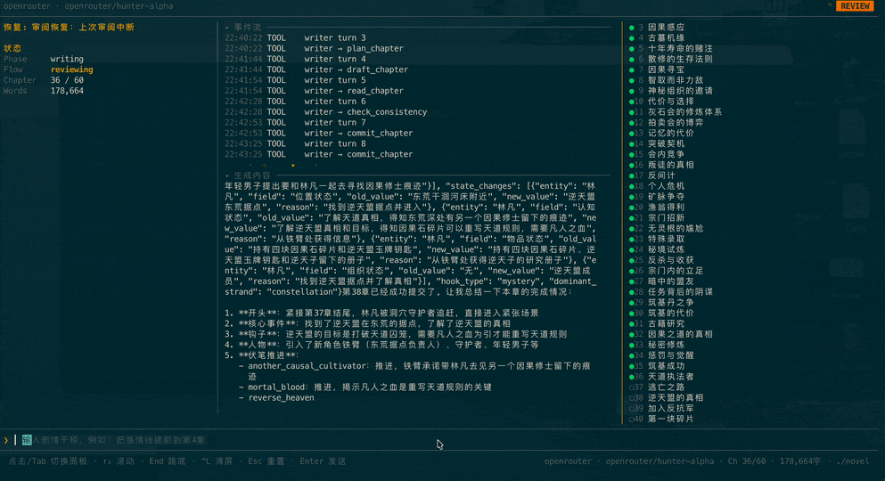
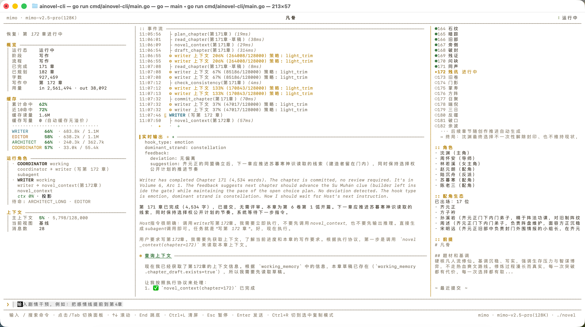

# ainovel-cli — Máy tạo kịch bản video TikTok Doodle Explainer

Hệ thống AI tự động tạo trọn gói kịch bản video TikTok dạng **"Doodle Explainer"** (nhân vật que thời đồ đá giải thích các chủ đề & xu hướng hot thời sự) bằng **100% Tiếng Việt**. 

Kiến trúc lõi là một **Engine xác định (Deterministic Engine)** điều phối 3 tác tử sáng tác độc lập (**Architect / Writer / Editor**) cùng trọng tài ngữ nghĩa (**Arbiter**). Hệ thống có khả năng tự động lấy tin xu hướng (Google Trends VN, VnExpress), bám nguồn dữ kiện (Fact-grounding), kiểm soát an toàn nội dung (Luật An ninh mạng VN & Tiêu chuẩn TikTok), và xuất ra toàn bộ gói dữ liệu sản xuất video (kịch bản phân cảnh, voiceover tách riêng, shotlist CSV, publish CSV).

<p align="center">
  
  
</p>

---

## Mục lục

1. [Điểm nổi bật](#điểm-nổi-bật)
2. [Định dạng kịch bản chuẩn TikTok](#định-dạng-kịch-bản-chuẩn-tiktok)
3. [Kiến trúc hệ thống](#kiến-trúc-hệ-thống)
4. [Cài đặt & Khởi động nhanh](#cài-đặt--khởi-động-nhanh)
5. [Tự động hóa xu hướng thời sự (--trends)](#tự-động-hóa-xu-hướng-thời-sự---trends)
6. [An toàn nội dung & Cổng duyệt người (--review / --next)](#an-toàn-nội-dung--cổng-duyệt-người---review----next)
7. [Xuất gói dữ liệu sản xuất video (/export --video)](#xuất-gói-dữ-liệu-sản-xuất-video-export---video)
8. [Cấu hình hệ thống & Mô hình LLM](#cấu-hình-hệ-thống--mô-hình-llm)
9. [Các lệnh TUI & Điều khiển thời gian thực](#các-lệnh-tui--điều-khiển-thời-gian-thực)
10. [Giấy phép](#giấy-phép)

---

## Điểm nổi bật

- **Chuyên biệt hóa Doodle Explainer Tiếng Việt**: Nhân vật que thời đồ đá (Gù, Tộc trưởng, Sói Đá...) dùng góc nhìn tiền sử để ẩn dụ hài hước và mổ xẻ những vấn đề thời sự hiện đại (AI, lạm phát, chứng khoán, thuật toán, áp lực đồng trang lứa...).
- **Quy cách kịch bản chuẩn Doodle Explainer từ 5 phút**: Mỗi tập là 1 video thời lượng từ 5 phút trở lên (khoảng 5-8 phút / 300–480s, ~750–1200 từ LỜI đọc), phân chia 5 giai đoạn mạch lạc (Hook 3s, Đặt vấn đề & kết nối đời thực, Thân bài 3 chặng có Tái Hook mỗi 60-90s, Reframe & hành động nhỏ, Chốt loop đúc kết), phân tách rõ ràng các trường: `LỜI:`, `HÌNH:`, `ÂM:` (bỏ hẳn phần `CHỮ:`, mọi thông điệp thể hiện qua lời đọc và hình vẽ), kết thúc bằng hook loop và chân kịch bản metadata.
- **Tự động thu nạp xu hướng (Trend Intake)**: Tích hợp sẵn bộ thu nạp RSS từ Google Trends Việt Nam và VnExpress. Cơ chế khử trùng lặp và Arbiter tự động lọc các chủ đề rác, nhạy cảm, chỉ giữ lại những chủ đề có tính thảo luận cao và phù hợp với góc nhìn đồ đá viral.
- **Bám nguồn dữ kiện (Fact-grounding) & An toàn nội dung**: Tuân thủ nghiêm ngặt Luật An ninh mạng 2018, Nghị định 15/2020/NĐ-CP (Điều 101) và Tiêu chuẩn cộng đồng TikTok. Dữ liệu chưa đủ căn cứ bắt buộc phải liệt kê trong thẻ `CẦN KIỂM CHỨNG:`.
- **Cổng duyệt người (Human Gate)**: Mặc định series theo xu hướng khởi chạy ở chế độ `review`. Chỉ khi người sáng tạo duyệt qua `/next` (hoặc `--next` ở headless), kịch bản tiếp theo mới được tiến hành sản xuất.
- **Xuất trọn gói dữ liệu sản xuất (Video Package Export)**: Tự động kết xuất thư mục `scripts/` (kịch bản hoàn chỉnh), `voiceover/` (chỉ có lời đọc sạch cho TTS hoặc thu âm), `shotlist.csv` (bảng phân cảnh kèm UTF-8 BOM cho Excel) và `publish.csv` (tiêu đề, caption, hashtag, nguồn).
- **Phục hồi từng bước (Step-level Checkpoint)**: Lưu trữ trạng thái sau từng công cụ (`plan`, `draft`, `check`, `commit`). Nếu gặp sự cố mạng hoặc tắt ngang máy, hệ thống tự động nối tiếp từ bước dở dang mà không mất dữ liệu.
- **Đa dạng LLM**: Hỗ trợ OpenRouter, Anthropic, Gemini, OpenAI, DeepSeek, Qwen, và các mô hình cục bộ qua Ollama.

---

## Định dạng kịch bản chuẩn TikTok

Mỗi tập video (`chapter`) được viết theo chuẩn định dạng nghiêm ngặt tại [`docs/script-format.md`](docs/script-format.md):

```markdown
# Tiêu đề video hấp dẫn (Không clickbait lừa dối)

HOOK 0:00-0:03
LỜI: [Lời đọc mở đầu giật hook giữ chân người xem]
HÌNH: [Mô tả nét vẽ que đơn giản, biểu cảm phóng đại]

CẢNH 1 0:03-0:45
LỜI: [Phần đầu: Đặt vấn đề đời thực quen thuộc, tạo lời hứa hẹn/tiền đề ẩn dụ]
HÌNH: [Nhân vật que trong tình huống đời thường dở khóc dở cười]
ÂM: [Nhạc nền hoặc tiếng động nhẹ]

CẢNH 2 0:45-1:45
LỜI: [Phần thân Chặng 1: Thiết lập ẩn dụ cốt lõi, mâu thuẫn ban đầu]
HÌNH: [Hành động hài hước của nhân vật đồ đá]

CẢNH 3 1:45-2:45
LỜI: [Phần thân Chặng 2: Tái Hook 1, đào sâu cơ chế, phản trực giác]
HÌNH: [Sơ đồ que hoặc cú lật tình huống]
ÂM: [Hiệu ứng âm thanh kịch tính]

CẢNH 4 2:45-3:45
LỜI: [Phần thân Chặng 3: Tái Hook 2, cao trào, liên hệ thực tế hiện đại]
HÌNH: [Tương phản giữa người đá và công sở/điện thoại]

CẢNH 5 3:45-4:30
LỜI: [Phần Reframe & Hành động: Đổi góc nhìn nhận thức + việc nhỏ làm được ngay]
HÌNH: [Nhân vật ngộ ra, hành động tự tin nhẹ nhõm]

CHỐT 4:30-5:15
LỜI: [Đúc kết bất ngờ, Loop Hook về đầu video hoặc câu hỏi mở kêu gọi bình luận]
HÌNH: [Cảnh kết tương tác với người xem, nút theo dõi và hộp bình luận]

CAPTION: [Mô tả ngắn gọn thu hút người xem đọc thêm]
HASHTAG: #doodle #explainer #trend #xuhuong #kienthuc
NGUỒN: [Link bài viết hoặc nguồn dữ kiện gốc]
CẦN KIỂM CHỨNG: [Các thông tin ước đoán hoặc số liệu cần đối soát]
```

---

## Kiến trúc hệ thống

Hệ thống tuân thủ nguyên lý: **Tầng sự thật xác định, Tầng ngữ nghĩa tự chủ** (Fact layer deterministic, Semantic layer autonomous).

```
┌─────────────────────────────────────────────────────────────┐
│                   Host / Engine (Xác định)                   │
│  Đọc Store → Tra bảng Route → Gọi Worker trực tiếp → Lặp   │
│  Chọn đề tài / Phân xử can thiệp / Cứu kẹt → Gọi Arbiter    │
└────────────┬─────────────┬─────────────┬─────────────┬──────┘
             │             │             │             │
        ┌────▼────┐   ┌────▼────┐   ┌────▼────┐   ┌────▼────┐
        │Architect│   │ Writer  │   │ Editor  │   │ Arbiter │
        │(LLM)    │   │(LLM)    │   │(LLM)    │   │(LLM func│
        └────┬────┘   └────┬────┘   └────┬────┘   └─────────┘
             └─────────────┼─────────────┘
                           │ Tool calls (Atomic IO + Saga + Checkpoint)
        ┌──────────────────▼──────────────────────────────────┐
        │                      Store                          │
        │  Progress / Checkpoints / Outline / Drafts / Trends │
        └─────────────────────────────────────────────────────┘
```

### Phân công tác tử

| Tác tử | Vai trò trong hệ thống Doodle Explainer | Công cụ sử dụng |
|---|---|---|
| **Arbiter** | Trọng tài ngữ nghĩa: Lọc & chấm điểm đề tài xu hướng, phân loại can thiệp của người dùng, quyết định hướng xử lý khi bế tắc | Không có (Gọi LLM dạng function có cấu trúc chặt chẽ) |
| **Architect** | Kiến trúc sư series: Đọc tóm tắt xu hướng (`trend_brief`), lập Series Bible, quy tắc vũ trụ đồ đá, danh sách tập và phân bổ ẩn dụ | `novel_context`, `save_book`, `save_foundation` |
| **Writer** | Biên kịch: Nhận dữ liệu nguồn (`source_pack`), triển khai kịch bản chi tiết theo nhịp 3s, kiểm tra tính nhất quán và nộp bản thảo | `novel_context`, `read_chapter`, `plan_chapter`, `draft_chapter`, `check_consistency`, `commit_chapter` |
| **Editor** | Biên tập viên: Thẩm định 7 chiều chất lượng (nhất quán, nhân vật, nhịp độ, liên kết tập, chi tiết cài cắm, chất lượng hook, tính mỹ cảm & khả thi hoạt họa), đối soát nguồn dữ kiện và cảnh báo nhạy cảm | `novel_context`, `read_chapter`, `save_review`, `save_arc_summary`, `save_volume_summary` |

---

## Cài đặt & Khởi động nhanh

### 1. Cài đặt từ mã nguồn (Yêu cầu Go >= 1.25)

```powershell
# Clone kho lưu trữ
git clone -b doodle-explainer https://github.com/voocel/ainovel-cli.git
cd ainovel-cli

# Biên dịch chương trình
go build -o ainovel-cli.exe ./cmd/ainovel-cli
```

### 2. Khởi chạy TUI (Giao diện dòng lệnh tương tác)

```powershell
.\ainovel-cli.exe
```

Lần đầu khởi chạy, chương trình sẽ tự động kích hoạt **Thuật sĩ cấu hình (Bootstrap Wizard)** để hướng dẫn bạn nhập Provider (OpenRouter, Gemini, Anthropic, Ollama...), API Key, Base URL và chọn Model. Toàn bộ cấu hình được lưu tại `~/.ainovel/config.json`.

Tại màn hình chính, bạn có thể:
- **Khởi đầu nhanh (Quick Start)**: Gõ 1 câu yêu cầu (ví dụ: *"Giải thích việc giá vàng nhảy múa bằng ẩn dụ hòn đá thần của người tiền sử"*).
- **Đồng sáng tạo (Co-create)**: Trao đổi nhiều lượt với AI để hoàn thiện đề cương, sau đó nhấn `Ctrl+S` để bắt đầu sinh kịch bản.

---

## Tự động hóa xu hướng thời sự (--trends)

Chương trình tích hợp sẵn hệ thống quét xu hướng thời sự Việt Nam:

```powershell
# Quét xu hướng tự động và chạy chế độ không giao diện (Headless)
.\ainovel-cli.exe --headless --trends
```

### Luồng xử lý xu hướng:
1. **Thu thập tin tức**: Tự động lấy các bài viết nóng từ Google Trends VN RSS và VnExpress RSS.
2. **Khử trùng lặp & Lưu trữ**: Trích xuất nội dung bài viết, tính toán băm SHA-256 lưu vào `output/trends/articles/`.
3. **Arbiter thẩm định đề tài**:
   - Loại bỏ rác tìm kiếm (kết quả xổ số, lịch bóng đá thuần túy...).
   - Loại bỏ chủ đề nhạy cảm chính trị, vi phạm pháp luật hoặc tin đồn vô căn cứ.
   - Ưu tiên chủ đề khoa học, công nghệ, kinh tế, đời sống xã hội có thể ẩn dụ hóa bằng góc nhìn đồ đá.
4. **Bơm dữ liệu nguồn vào kịch bản**:
   - `trend_brief` được nạp cho **Architect** để lập đề cương series.
   - `source_pack` (tiêu đề, tóm tắt, luận điểm chính, số liệu có căn cứ) được chuyển cho **Writer** để viết kịch bản bám sát sự thật.

---

## An toàn nội dung & Cổng duyệt người (--review / --next)

Để đảm bảo video đăng tải lên TikTok không bị quét vi phạm tiêu chuẩn cộng đồng hoặc vi phạm pháp luật Việt Nam (Luật An ninh mạng 2018, Nghị định 15/2020/NĐ-CP Điều 101), hệ thống áp dụng cơ chế bảo vệ 3 lớp:

1. **Bộ quy tắc cấm kỵ mặc định (`SystemDefaults.Preferences`)**: Tự động tích hợp trong `internal/rules/snapshot.go`:
   - Nghiêm cấm thông tin sai sự thật về chính trị, an ninh quốc phòng, lãnh thổ chủ quyền.
   - Nghiêm cấm tin đồn giật gân, xúc phạm danh dự cá nhân, tổ chức.
   - Nghiêm cấm tư vấn y tế/tài chính cam kết sai lệch, mê tín dị đoan.
2. **Thẻ `CẦN KIỂM CHỨNG:` bắt buộc**: Validator [`internal/tools/script_format.go`](internal/tools/script_format.go) sẽ phát cảnh báo nếu kịch bản thiếu thẻ này hoặc đưa ra số liệu suy đoán không có trong nguồn.
3. **Cổng duyệt người (Human-in-the-loop Gate)**:
   - Khi chạy với `--trends`, hệ thống mặc định kích hoạt chế độ `review`.
   - Sau khi hoàn thành một tập, hệ thống tạm dừng và chờ lệnh của bạn:
   ```powershell
   # Trong TUI:
   /review on    # Bật chế độ duyệt từng tập
   /next         # Cấp phép sản xuất tiếp tập sau
   /review off   # Tắt chế độ duyệt, cho phép máy chạy tự động liên tục

   # Trong chế độ Headless:
   .\ainovel-cli.exe --headless --next   # Cấp phép cho tập tiếp theo tiếp tục chạy
   ```

---

## Xuất gói dữ liệu sản xuất video (/export --video)

Sau khi hoàn thành các tập kịch bản, bạn có thể xuất toàn bộ tài nguyên để chuyển cho bộ phận sản xuất hình ảnh / âm thanh:

### Sử dụng lệnh trong TUI:
```text
/export --video
```

Hoặc xuất định dạng cụ thể ra thư mục chỉ định:
```text
/export format=video ./ban-giao-video/
```

### Cấu trúc thư mục xuất ra:
```
ban-giao-video/
├── scripts/                    # Toàn bộ kịch bản chi tiết chuẩn Markdown
│   ├── 01-vi-sao-gia-vang-tang.md
│   └── 02-thuat-toan-tiktok-la-gi.md
├── voiceover/                  # File text chứa lời đọc sạch (chỉ gồm các dòng LỜI:)
│   ├── 01-vi-sao-gia-vang-tang.txt
│   └── 02-thuat-toan-tiktok-la-gi.txt
├── shotlist.csv                # Bảng phân cảnh chi tiết (Tập, Khối, Mốc thời gian, LỜI, HÌNH, CHỮ, ÂM)
└── publish.csv                 # Bảng dữ liệu đăng tải TikTok (Tập, Tiêu đề, Thời lượng, CAPTION, HASHTAG, NGUỒN)
```

> [!TIP]
> Các file `.csv` được xuất kèm **UTF-8 BOM** (`\xef\xbb\xbf`), giúp hiển thị tiếng Việt có dấu chuẩn xác 100% khi mở trực tiếp bằng Microsoft Excel trên Windows.

---

## Cấu hình hệ thống & Mô hình LLM

Tệp cấu hình mẫu được đặt tại [`config.example.jsonc`](config.example.jsonc). Bạn có thể cấu hình nhà cung cấp LLM, mô hình và các tham số vận hành:

```jsonc
{
  "provider": "openrouter",
  "model": "google/gemini-2.5-flash",
  "reasoning_effort": "medium",
  "providers": {
    "openrouter": {
      "api_key": "sk-or-v1-xxxxxxxxxxxx",
      "base_url": "https://openrouter.ai/api/v1",
      "models": [
        { "name": "google/gemini-2.5-flash", "context_window": 200000 },
        { "name": "anthropic/claude-3.5-sonnet", "context_window": 200000 }
      ]
    },
    "ollama": {
      "base_url": "http://localhost:11434/v1"
    }
  },
  "roles": {
    "architect": { "model": "google/gemini-2.5-flash" },
    "writer": { "model": "google/gemini-2.5-flash" },
    "editor": { "model": "google/gemini-2.5-flash" }
  },
  "style": "doodle-explainer",
  "advance_mode": "review",
  "trends": {
    "enabled": true,
    "max_topics": 5,
    "sources": ["google_trends_vn", "vnexpress"]
  }
}
```

---

## Các lệnh TUI & Điều khiển thời gian thực

Trong quá trình hệ thống đang hoạt động trong TUI, bạn có thể gõ các lệnh sau vào ô nhập liệu:

- `/help`: Xem danh sách tất cả các lệnh khả dụng.
- `/review on|off`: Bật / tắt chế độ duyệt kịch bản từng tập.
- `/next`: Cấp phép sản xuất tập tiếp theo khi đang ở chế độ duyệt.
- `/export [--video] [đường_dẫn]`: Xuất toàn bộ kịch bản ra định dạng TXT, EPUB hoặc trọn bộ Video Package.
- `/config`: Mở màn hình chỉnh sửa Provider, API Key, Base URL.
- `/model`: Chuyển đổi nhanh mô hình LLM hoặc độ sâu suy luận (reasoning effort).
- `/sync`: Đồng bộ và chấp nhận các chỉnh sửa thủ công mà bạn đã sửa trực tiếp trong các file kịch bản `output/{tên_series}/chapters/*.md`.
- `/diag`: Chạy báo cáo chẩn đoán chất lượng nội dung, tiến độ và cấu trúc kịch bản.
- **Can thiệp trực tiếp (Steer)**: Gõ trực tiếp ý kiến vào thanh lệnh mà không cần gõ dấu `/` (Ví dụ: *"Đổi nhân vật người que chính sang tên Tộc trưởng Gồ và tăng thêm yếu tố hài hước"*), hệ thống Arbiter sẽ tự động điều phối để áp dụng ngay vào tập tiếp theo.

---

## Lời cảm ơn & Nguồn tham khảo

Dự án này được kế thừa, tùy biến và phát triển dựa trên nền tảng kiến trúc Deterministic Engine mã nguồn mở từ dự án gốc [ainovel-cli](https://github.com/voocel/ainovel-cli) của tác giả [voocel](https://github.com/voocel). Xin chân thành cảm ơn tác giả và cộng đồng [linux.do](https://linux.do/) đã xây dựng nền tảng kiến trúc tuyệt vời này.

---

## Giấy phép

Phần mềm phát hành theo giấy phép [MIT License](LICENSE).
Tương thích hoàn toàn trên Windows, Linux và macOS.

