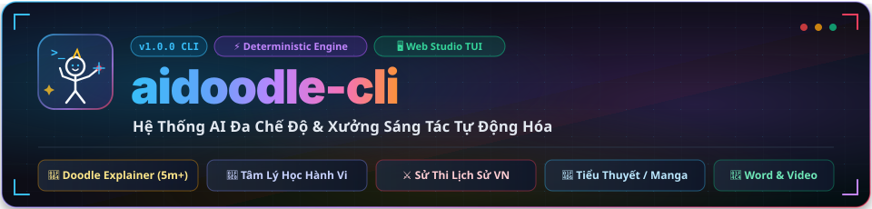
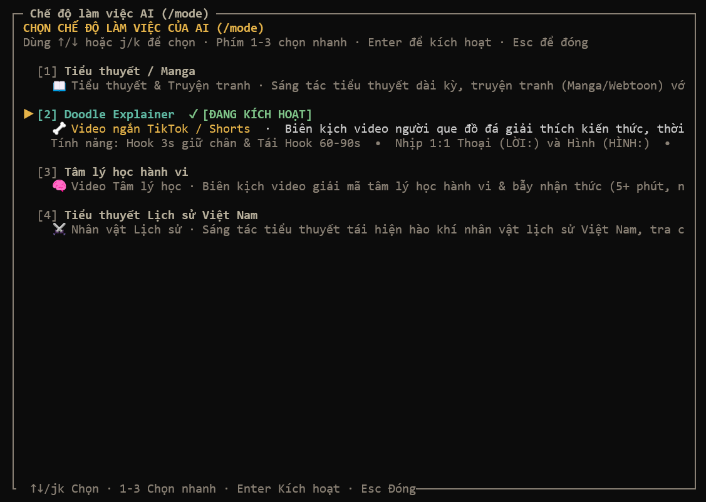
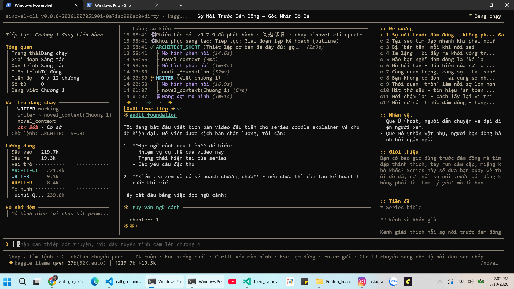
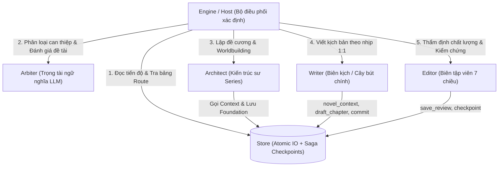

<p align="center">
  
</p>

<p align="center">
  <a href="https://github.com/vinh-gogo/aidoodle-cli/releases"></a>
  
  
  
  
  
</p>

<p align="center">
  <strong>Bộ công cụ dòng lệnh (CLI) tự động hóa quy trình sáng tác nội dung chuyên sâu bằng 100% Tiếng Việt.</strong><br>
  Từ kịch bản video TikTok <strong>Doodle Explainer</strong> (nhân vật que đồ đá) triệu view, video <strong>Tâm lý học hành vi</strong> sâu sắc, cho đến <strong>Tiểu thuyết Lịch sử Việt Nam</strong> hào sảng và <strong>Tiểu thuyết / Manga</strong> kỳ ảo đa tầng.
</p>

<p align="center">
  
  <br>
  <em>Giao diện modal chọn chế độ AI làm việc (/mode) với 4 phong cách chuyên biệt</em>
  <br><br>
  
  <br>
  <em>Quy trình làm việc tương tác thời gian thực trong giao diện dòng lệnh TUI</em>
</p>

---

## 🌟 Điểm Nổi Bật Vượt Trội

- 🎯 **4 Chế độ làm việc AI chuyên biệt (`/mode`)**: Phân tách độc lập 100% kho tài nguyên prompt, voice, style, reference và gated validator; chuyển đổi tức thì chỉ bằng một phím bấm.
- 🗂️ **Dashboard Quản lý Tác phẩm Trực quan (`/dash`)**: Gõ `/dash` để mở giao diện quản lý toàn bộ outputs trong `output/`, tự động gắn **Tag Mode** (`[🧠 Tâm lý học]`, `[⚔️ Lịch sử VN]`, `[🦴 Video TikTok]`, `[📖 Tiểu thuyết]`), hiển thị tiến độ và chuyển đổi dự án lập tức.
- ✨ **Khởi tạo Phiên mới Siêu Tốc (`/new`)**: Gõ `/new` -> Enter để bắt đầu ngay session mới trong thư mục output timestamp riêng mà không cần nhập thêm tham số.
- 🏛️ **Tiểu thuyết Lịch sử Việt Nam Chuẩn mực**: Quán triệt tôn chỉ *"Đúng đủ để người đọc tin, sống đủ để người đọc quan tâm"*. Khung phương pháp luận gồm **Bảng bất biến lịch sử**, **Bảng vùng tự do**, **Xung đột kép** (đời tư va đập thời cuộc), **12 Kỹ thuật hook lịch sử sắc bén** và **Bộ kiểm tra nhanh 5 câu hỏi vàng**.
- 🧠 **Tâm lý học Hành vi Chuẩn Khoa học**: Cấu trúc 8 bước kết hợp kể chuyện cuốn hút: mở đầu từ trải nghiệm người đọc, phân biệt rạch ròi tương quan vs nhân quả, cảnh báo khủng hoảng tái lập, mẫu nghiên cứu WEIRD và Cú hích hành vi (Nudge) thực chiến.
- 🦴 **Quy cách Doodle Explainer 5+ Phút Chuẩn Viral**: Kịch bản video người que tiền sử (5–8 phút, 700–1500 từ LỜI), nhịp 1:1 Thoại - Hình xen kẽ liên tục (đổi nét vẽ mỗi 3–6s), cấu trúc 5 giai đoạn có Tái Hook mỗi 60–90s.
- 🌐 **Tra cứu Thời gian thực & Tavily Graceful Fallback**: Tích hợp Tavily Search & Crawl tra cứu sử liệu và kiến thức học thuật. Khi mất mạng hoặc chưa có key, hệ thống tự động suy giảm chức năng an toàn (Graceful Fallback) để LLM vận dụng tri thức sẵn có mà không bao giờ bị đứt gãy luồng ReAct.
- ⚙️ **Deterministic Engine & Checkpoint Saga**: Kiến trúc xác định độc quyền điều phối 3 tác tử (**Architect / Writer / Editor**) cùng trọng tài ngữ nghĩa (**Arbiter**). Lưu vết trạng thái từng bước (Step-level atomic IO), tự phục hồi khi tắt máy ngang.
- 📦 **Xuất Trọn Gói Sản Xuất Video (`/export --video`)**: Kết xuất đồng bộ `scripts/` (kịch bản hoàn chỉnh), `voiceover/` (lời đọc sạch cho thu âm/TTS), `shotlist.csv` (bảng phân cảnh kèm UTF-8 BOM cho Excel) và `publish.csv` (tiêu đề, caption, hashtag, nguồn).

---

## 📑 Mục Lục

1. [4 Chế Độ Làm Việc AI Chuyên Biệt (/mode)](#4-chế-độ-làm-việc-ai-chuyên-biệt-mode)
2. [Dashboard Quản Lý Outputs (/dash) & Khởi Tạo Mới (/new)](#dashboard-quản-lý-outputs-dash--khởi-tạo-mới-new)
3. [Kiến Trúc Hệ Thống (Deterministic Engine)](#kiến-trúc-hệ-thống-deterministic-engine)
4. [Định Dạng Kịch Bản Video Chuẩn TikTok](#định-dạng-kịch-bản-video-chuẩn-tiktok)
5. [Cài Đặt & Khởi Động Nhanh Trong 60 Giây](#cài-đặt--khởi-động-nhanh-trong-60-giây)
6. [Tích Hợp Tavily Search & Graceful Fallback](#tích-hợp-tavily-search--graceful-fallback)
7. [An Toàn Nội Dung & Cổng Duyệt Người (/review)](#an-toàn-nội-dung--cổng-duyệt-người-review)
8. [Xuất Gói Dữ Liệu Sản Xuất Video (/export)](#xuất-gói-dữ-liệu-sản-xuất-video-export)
9. [Bảng Tra Cứu Lệnh TUI Thời Gian Thực](#bảng-tra-cứu-lệnh-tui-thời-gian-thực)
10. [Giấy Phép & Đóng Góp](#giấy-phép--đóng-góp)

---

## 🎭 4 Chế Độ Làm Việc AI Chuyên Biệt (/mode)

Khi nhập lệnh `/mode` (hoặc alias `/topic`, `/topics`) trong TUI, bảng chọn trực quan cho phép bạn chuyển đổi linh hoạt:

| Phím | Chế độ | Định dạng | Quy cách & Trọng tâm nghiệp vụ |
| :---: | :--- | :--- | :--- |
| **`1`** | **Tiểu thuyết / Manga**<br>`novel-manga` | Tiểu thuyết văn xuôi | 2.000 – 4.000 từ/chương, cấu trúc chương hồi, thế giới quan đa tầng, chiều sâu nội tâm nhân vật và quy tắc ma pháp/hệ thống chặt chẽ. |
| **`2`** | **Doodle Explainer**<br>`doodle-explainer` | Kịch bản video người que | 5+ phút (300–600s, 700–1500 từ LỜI), nhịp 1:1 Thoại - Hình (đổi hình mỗi 3–6s), cấu trúc 5 giai đoạn, Tái Hook mỗi 60–90s, dí dỏm viral TikTok/Shorts. |
| **`3`** | **Tâm lý học hành vi**<br>`behavioral-psychology` | Kịch bản video tâm lý | 5+ phút, chuẩn mực 8 bước khoa học kết hợp nghệ thuật kể chuyện cuốn hút. Phân biệt tương quan vs nhân quả, cảnh báo khủng hoảng tái lập, Cú hích hành vi (Nudge) và tự trắc ẩn vỗ về đứa trẻ bên trong. |
| **`4`** | **Tiểu thuyết Lịch sử Việt Nam**<br>`vietnamese-history` | Tiểu thuyết sử thi dã sử | 2.000 – 4.000 từ/chương. Tôn chỉ *"Đúng đủ để người đọc tin, sống đủ để người đọc quan tâm"*. Lập Bảng bất biến & Bảng vùng tự do, Xung đột kép (đời tư chạm thời cuộc), 12 Kỹ thuật hook lịch sử, 5 câu hỏi vàng kiểm tra nhanh. Xưng hô Đại Việt, sạch chữ Hán 100%. |

> [!TIP]
> **Thao tác nhanh**: Nhấn trực tiếp các phím số `1`, `2`, `3`, `4` để chuyển đổi tức thì. Bộ kiểm tra kịch bản video (`lintScript`) chỉ kích hoạt ở mode `2` và `3`, hoàn toàn giải phóng độ dài cho các mode tiểu thuyết `1` và `4`.

---

## 🗂️ Dashboard Quản Lý Outputs (/dash) & Khởi Tạo Mới (/new)

### 1. Dashboard `/dash` (hoặc `/dashboard`, `/projects`, `/history`)
Chỉ cần gõ `/dash` -> Enter, bạn sẽ thấy giao diện quản lý toàn bộ tác phẩm:
- **Tự động gắn Tag Mode**: `[🧠 Tâm lý học hành vi]`, `[⚔️ Lịch sử Việt Nam]`, `[🦴 Video TikTok]`, `[📖 Tiểu thuyết / Manga]`.
- **Hiển thị tiến độ rõ ràng**: `✓ Đã xong (3/3)`, `⏳ Đang viết (1/3)`, `🌱 Khởi tạo`, kèm đường dẫn thư mục và timestamp sửa đổi.
- **Đánh dấu dự án hiện tại**: Ký hiệu `⭐ [Đang mở]` giúp định vị nhanh.
- **Chuyển đổi tức thì**: Dùng mũi tên `↑`/`↓` hoặc `j`/`k`, nhấn `Enter` để chuyển đổi dự án, hệ thống sẽ tự động nạp đúng bundle chế độ và khôi phục tiến trình làm việc.

### 2. Lệnh khởi tạo nhanh `/new`
- Gõ `/new` -> Enter để bắt đầu ngay một phiên làm việc mới tinh tươm trong thư mục phân lập `output/novel-YYYYMMDD-HHMM` mà không cần nhập thêm bất kỳ tham số phức tạp nào.

---

## 🏛️ Kiến Trúc Hệ Thống (Deterministic Engine)

Hệ thống tuân thủ nguyên lý: **Tầng sự thật xác định, Tầng ngữ nghĩa tự chủ** (*Fact layer deterministic, Semantic layer autonomous*).



### Phân công tác tử chuyên biệt

| Tác tử | Nhiệm vụ chính trong quy trình | Công cụ sử dụng |
|---|---|---|
| **Arbiter** | Trọng tài ngữ nghĩa: Lọc đề tài xu hướng, phân loại can thiệp của người dùng, phá vỡ bế tắc ReAct | Gọi LLM có cấu trúc chặt chẽ (Structured function call) |
| **Architect** | Kiến trúc sư: Đọc dữ liệu, lập Series Bible, quy tắc thế giới, lập Bảng bất biến / Vùng tự do, phân bổ dàn ý các tập | `novel_context`, `save_book`, `save_foundation` |
| **Writer** | Ngòi bút sáng tác: Nhận `source_pack`, nạp đầy đủ kỹ thuật hook và cẩm nang qua `novel_context`, triển khai bản thảo 2.000–4.000 từ (tiểu thuyết) hoặc nhịp 1:1 Thoại - Hình (video), nộp qua `commit_chapter` | `novel_context`, `plan_chapter`, `draft_chapter`, `check_consistency`, `commit_chapter` |
| **Editor** | Biên tập viên: Thẩm định 7 chiều (nhất quán, nhân vật, nhịp độ, liên kết tập, chi tiết cài cắm, hook, mỹ cảm/sử liệu), đối soát nguồn và cảnh báo vi phạm | `novel_context`, `read_chapter`, `save_review`, `save_arc_summary`, `save_volume_summary` |

---

## 🎬 Định Dạng Kịch Bản Video Chuẩn TikTok

Mỗi tập video ở chế độ Doodle Explainer hoặc Tâm lý học hành vi tuân thủ nhịp 1:1 Thoại - Hình:

```markdown
# Tiêu đề video hấp dẫn (Không clickbait lừa dối)

HOOK 0:00-0:03
LỜI: Người lính chèo thuyền đêm ấy chỉ lo một chuyện: nước triều lên chậm quá.
HÌNH: Bàn tay que run rẩy cắm mái chèo xuống dòng nước sông Bạch Đằng cuộn sóng dữ.

CẢNH 1 0:03-0:45
LỜI: Ai đọc sử cũng biết trận này quân ta sẽ đại thắng. Nhưng người lính ấy thì không biết...
HÌNH: Nhân vật que ngồi co ro nơi mạn thuyền, ánh mắt đăm đăm nhìn vào màn đêm mù sương.
ÂM: Tiếng gió bấc rít từng cơn buốt giá.

CẢNH 2 0:45-1:45
LỜI: [Chặng 1: Thiết lập mâu thuẫn đời thường, dẫn nhập cơ chế phản trực giác]
HÌNH: [Minh họa sơ đồ que đơn giản, biểu cảm phóng đại]

CẢNH 3 1:45-2:45
LỜI: [Chặng 2: Tái Hook 1, đào sâu bằng chứng khoa học hoặc thế trận lịch sử]
HÌNH: [Cú lật tình huống hài hước hoặc kịch tính]
ÂM: [Hiệu ứng âm thanh nhấn mạnh]

CẢNH 4 2:45-3:45
LỜI: [Chặng 3: Tái Hook 2, cao trào, liên hệ thực tế nhân sinh hiện đại]
HÌNH: [Soi chiếu tâm lý, chuyển đổi góc nhìn]

CẢNH 5 3:45-4:30
LỜI: [Reframe & Hành động nhỏ: Đổi góc nhìn nhận thức, việc làm thử được ngay]
HÌNH: [Nhân vật que ngộ ra, hành động nhẹ nhõm tự tin]

CHỐT 4:30-5:15
LỜI: [Đúc kết bất ngờ, Loop Hook quay lại đầu video hoặc câu hỏi gợi mở thảo luận]
HÌNH: [Cảnh kết tương tác, icon theo dõi và khung bình luận]

CAPTION: Tóm tắt 1-2 câu súc tích mở rộng giá trị bài học.
HASHTAG: #doodle #explainer #lichsu #tamly #kienthuc
NGUỒN: Đại Việt Sử Ký Toàn Thư / Nghiên cứu Kahneman (2011)
CẦN KIỂM CHỨNG: Số liệu ước đoán về quân số cần đối chiếu thêm với tài liệu khảo cổ.
```

---

### 🚀 Cách 1: Tải Bản Đóng Gói Sẵn Cho Windows (Khuyên Dùng — Không Cần Cài Go)

Dành cho người dùng Windows muốn sử dụng ngay lập tức mà không cần cài đặt môi trường lập trình Go:

1. Truy cập trang **[GitHub Releases](https://github.com/vinh-gogo/aidoodle-cli/releases)** để tải file **`aidoodle-cli-windows-amd64.zip`**.
2. Giải nén file `.zip` vào bất kỳ thư mục nào trên máy tính.
3. Chạy trực tiếp **`aidoodle-cli.exe`** (hoặc click đúp file **`Chay-AiDoodle.bat`**) để khởi chạy giao diện TUI ngay lập tức!

---

### 🛠️ Cách 2: Cài Đặt & Biên Dịch Từ Mã Nguồn (Windows, Linux, macOS)

Dành cho nhà phát triển muốn tùy biến hoặc người dùng Linux / macOS:

- **Yêu cầu**: Đã cài đặt [Git](https://git-scm.com/) và [Go >= 1.25](https://go.dev/dl/).

```bash
# 1. Clone kho lưu trữ
git clone https://github.com/vinh-gogo/aidoodle-cli.git
cd aidoodle-cli

# 2. Biên dịch chương trình
go build -o aidoodle-cli.exe ./cmd/ainovel-cli   # Trên Windows
# go build -o aidoodle-cli ./cmd/ainovel-cli     # Trên Linux / macOS

# 3. Khởi chạy giao diện TUI
.\aidoodle-cli.exe   # Hoặc ./aidoodle-cli
```

---

### 🌐 Cách 3: Chạy & Theo Dõi Trên Trình Duyệt Web (web)

Bạn muốn trải nghiệm trên trình duyệt Web (Desktop, Điện thoại, Máy tính bảng)?
Khởi chạy chế độ Web Dashboard với:

```bash
.\aidoodle-cli.exe web 8080   # Hoặc .\aidoodle-cli.exe --web 8080
```

Mở trình duyệt truy cập: **`http://localhost:8080`**
- **Single Page App 3 cột hiện đại**:
  - **Cột Trái**: Bộ chọn chế độ AI (`/mode`), mục lục các chương và lịch sử tác phẩm cũ (`/dash`).
  - **Cột Giữa**: Luồng văn bản streaming Markdown thời gian thực + trình đọc truyện Reader ban đêm.
  - **Cột Phải**: Luồng sự kiện live (hiển thị chi tiết từng truy vấn `tavily_search`, phán quyết Arbiter, tiến độ Writer/Editor).
  - **Thanh Điều Khiển Dưới**: Nhập đề tài sáng tác hoặc gửi chỉ đạo can thiệp (Steer) trực tiếp cho AI.
- **Zero dependencies**: Giao diện được nhúng trực tiếp vào file nhị phân Go bằng `//go:embed`, không cần Node.js hay npm.

---

## 🔍 Tích Hợp Tavily Search & Graceful Fallback

- **Cấu hình đơn giản**: Tạo file `.env` tại thư mục dự án:
  ```env
  TAVILY_API_KEY=tvly-xxxxxxxxxxxxxxxxxxxxxxxx
  ```
- **Tự động suy giảm chức năng an toàn (Graceful Fallback)**:
  - Nếu chưa có key Tavily hoặc gặp sự cố mạng (HTTP 40x/50x), công cụ `tavily_search` tự động chuyển sang phản hồi mềm, hướng dẫn LLM khai thác tri thức học thuật sẵn có.
  - **Triệt tiêu 100% sự cố đứt gãy luồng ReAct** hay bế tắc *"Chỉ lệnh liên tiếp 5 lần không có tiến triển"*.

---

## 🛡️ An Toàn Nội Dung & Cổng Duyệt Người (/review)

1. **Bộ quy tắc an toàn mặc định**: Tuân thủ Luật An ninh mạng Việt Nam 2018, Nghị định 15/2020/NĐ-CP (Điều 101) và Tiêu chuẩn cộng đồng TikTok.
2. **Cổng duyệt người (Human-in-the-loop Gate)**:
   - Khi chạy ở chế độ review, hệ thống sẽ tạm dừng sau mỗi tập để bạn thẩm định:
   ```text
   /review on    # Bật chế độ duyệt từng tập
   /next         # Cấp phép cho máy sản xuất tập tiếp theo
   /review off   # Tắt chế độ duyệt, cho phép máy chạy tự động
   ```

---

## 📦 Xuất Gói Dữ Liệu Sản Xuất Video (/export)

Sau khi hoàn thành các tập kịch bản, bạn chỉ cần gõ:

```text
/export --video
```

Hệ thống sẽ tạo ngay thư mục bàn giao sản xuất chuyên nghiệp:

```
output/novel-YYYYMMDD-HHMM/export/
├── scripts/                    # Kịch bản hoàn chỉnh chuẩn Markdown
│   ├── 01-dem-dien-hong.md
│   └── 02-khoi-lo-ren-van-kiep.md
├── voiceover/                  # Lời đọc sạch 100% dành cho thu âm / Voice AI (TTS)
│   ├── 01-dem-dien-hong.txt
│   └── 02-khoi-lo-ren-van-kiep.txt
├── shotlist.csv                # Bảng phân cảnh chi tiết (Tập, Cảnh, Thời gian, LỜI, HÌNH, ÂM)
└── publish.csv                 # Bảng metadata đăng bài TikTok (Tiêu đề, Caption, Hashtag, Nguồn)
```

> [!TIP]
> Tất cả file `.csv` được xuất kèm **UTF-8 BOM** (`\xef\xbb\xbf`), đảm bảo mở bằng **Microsoft Excel** trên Windows hiển thị tiếng Việt có dấu chuẩn xác 100% không bị lỗi font.

---

## ⌨️ Bảng Tra Cứu Lệnh TUI Thời Gian Thực

| Lệnh | Phím tắt / Alias | Chức năng chi tiết |
|---|---|---|
| `/dash` | `/dashboard`, `/projects`, `/history` | Mở Dashboard trực quan quản lý toàn bộ tác phẩm, hiển thị tag mode và chuyển đổi dự án lập tức |
| `/new` | — | Khởi tạo phiên sáng tác mới sạch trong thư mục timestamp riêng |
| `/mode` | `/topic`, `/topics` (Phím `1`-`4`) | Mở modal chọn 1 trong 4 chế độ AI chuyên biệt |
| `/review` | `on` / `off` | Bật / tắt chế độ duyệt kịch bản từng tập |
| `/next` | — | Cấp phép sản xuất tập tiếp theo khi đang ở chế độ duyệt |
| `/export` | `--video`, `format=video` | Xuất trọn gói dữ liệu sản xuất video (scripts, voiceover, shotlist, publish) |
| `/config` | — | Mở màn hình cấu hình Provider, API Key, Base URL |
| `/model` | — | Đổi nhanh Model LLM hoặc tinh chỉnh Reasoning Effort |
| `/sync` | — | Đồng bộ hóa các chỉnh sửa thủ công từ file `.md` vào Store |
| `/diag` | — | Chạy báo cáo chẩn đoán chất lượng nội dung, tiến độ và cấu trúc kịch bản |
| `/help` | — | Xem danh sách tất cả các lệnh khả dụng |
| *(Gõ tự do)* | Steer | Can thiệp trực tiếp ý kiến vào thanh lệnh để Arbiter điều phối áp dụng ngay |

---

## 📄 Giấy Phép & Lời Cảm Ơn

- Phần mềm được phát hành theo giấy phép mã nguồn mở **[MIT License](LICENSE)**.
- Kế thừa và phát triển từ nền tảng kiến trúc Deterministic Engine của dự án gốc [ainovel-cli](https://github.com/voocel/ainovel-cli) bởi tác giả [voocel](https://github.com/voocel) và cộng đồng [linux.do](https://linux.do/).
- Bản quyền thuộc về cộng đồng sáng tạo nội dung Tiếng Việt. Chúc bạn tạo nên những tác phẩm xuất sắc! 🇻🇳
